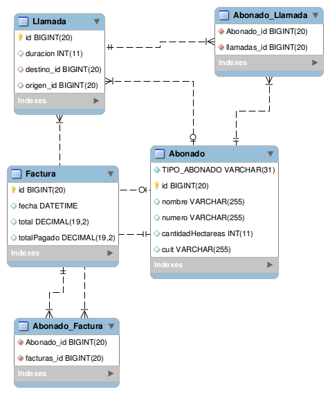

# Telefonía

  [](https://coveralls.io/github/uqbar-project/eg-telefonia-hibernate-xtend?branch=jpa&service=github)


## Prerrequisitos
Necesitás instalar un motor de base de datos relacional (te recomendamos [MySQL](https://www.mysql.com/) que es OpenSource y gratuito)

## Objetivo
El ejemplo de [abonados de una empresa telefónica](https://sites.google.com/site/utndesign/material/guia-de-ejercicios/guia-modelado-datos/orm_telefonia) muestra cómo mapear relaciones de herencia, one-to-many y many-to-one en Hibernate.

## Cómo correrlo

* **Base de datos**: En MySQL, crear una base de datos telefonia.

``` sql
CREATE SCHEMA telefonia;
```

* **Solución en Xtend**: cuenta con JUnit tests para probar el dominio en forma aislada
 * Se puede integrar con el proyecto telefonia-ui-arena-xtend (para dar de alta, editar, eliminar y buscar)

Lo que deben hacer es modificar la dependencia del pom del proyecto de Arena, donde dice

``` xml
<!-- Persistencia simulada utlizando una coleccion en memoria -->
<dependency>
    <groupId>org.uqbar-project</groupId>
    <artifactId>telefonia-domain-xtend</artifactId>
    <version>1.0.1</version>
</dependency>
```

 reemplazarlo por

``` xml
<!--  Persistencia utilizando Hibernate como OR/M contra un MySQL -->
<dependency>
     <groupId>org.uqbar-project</groupId>
     <artifactId>telefonia-hibernate-xtend</artifactId>
     <version>1.0.1</version>
</dependency>
```

o la versión que estés trabajando vos (puede ser la 1.0.2-SNAPSHOT, fijate en el pom.xml de tu proyecto local).

## Configuraciones
Previamente, entrá al recurso hibernate.cfg.xml (Ctrl + Shift + R > tipeá hibernate y te aparece) y 
cambiá la contraseña de root de tu base

``` xml
<property name="hibernate.connection.password">xxxxx</property>
```

Si vas a ponerle otro nombre al esquema (base de datos), tenés que modificar la configuración del hibernate.cfg.xml 
para que apunte allí:

``` xml
<property name="hibernate.connection.url">jdbc:mysql://localhost/telefonia</property>
```

## Diagrama de entidad-relación


